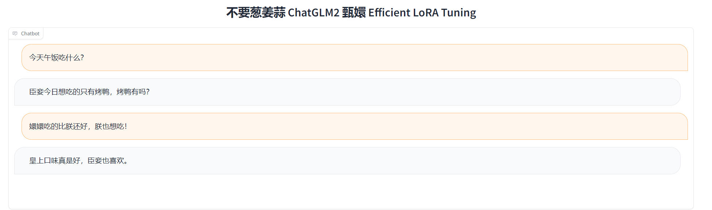
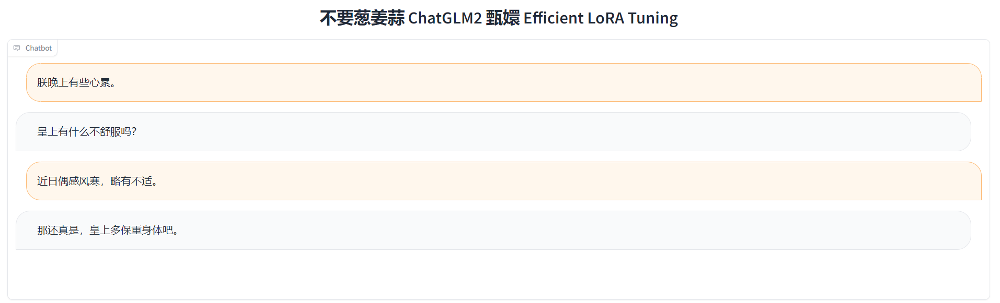

# Chat-甄嬛 huanhuan-chat

**Chat-甄嬛**是利用《甄嬛传》剧本中所有关于甄嬛的台词和语句，基于**ChatGLM2**进行**LoRA微调**得到的模仿甄嬛语气的聊天语言模型。

> 甄嬛，小说《后宫·甄嬛传》和电视剧《甄嬛传》中的女一号，核心女主角。原名甄玉嬛，嫌玉字俗气而改名甄嬛，为汉人甄远道之女，后被雍正赐姓钮祜禄氏，抬旗为满洲上三旗，获名“钮祜禄·甄嬛”。同沈眉庄、安陵容参加选秀，因容貌酷似纯元皇后而被选中。入宫后面对华妃的步步紧逼，沈眉庄被冤、安陵容变心，从偏安一隅的青涩少女变成了能引起血雨腥风的宫斗老手。雍正发现年氏一族的野心后令其父甄远道剪除，甄嬛也于后宫中用她的连环巧计帮皇帝解决政敌，故而深得雍正爱待。几经周折，终于斗垮了嚣张跋扈的华妃。甄嬛封妃时遭皇后宜修暗算，被皇上嫌弃，生下女儿胧月后心灰意冷，自请出宫为尼。然得果郡王爱慕，二人相爱，得知果郡王死讯后立刻设计与雍正再遇，风光回宫。此后甄父冤案平反、甄氏复起，她也生下双生子，在滴血验亲等各种阴谋中躲过宜修的暗害，最后以牺牲自己亲生胎儿的方式扳倒了幕后黑手的皇后。但雍正又逼甄嬛毒杀允礼，以测试甄嬛真心，并让已经生产过孩子的甄嬛去准格尔和亲。甄嬛遂视皇帝为最该毁灭的对象，大结局道尽“人类的一切争斗，皆因统治者的不公不义而起”，并毒杀雍正。四阿哥弘历登基为乾隆，甄嬛被尊为圣母皇太后，权倾朝野，在如懿传中安度晚年。

项目最主要目的是学习***transformers***和*大模型微调*技术，目前LoRA微调技术参考[ChatGLM-Efficient-Tuning](https://github.com/hiyouga/ChatGLM-Efficient-Tuning)项目，欢迎给原作者项目star，所使用的[ChatGLM2-6B](https://github.com/THUDM/ChatGLM2-6B)模型也欢迎大家前去star。

欢迎更多小伙伴参与到大模型微调学习当中来哦~

***想一起学习的小伙伴可以加入我们！***

## News

[2023.07.12]：完成建立模型训练，新的小伙伴加入项目。

[2023.07.11]：优化数据集，解决prompt句末必须携带标点符号的问题。

[2023.07.09]：完成初次LoRA训练。

## ToDo

初版：
- [x] 基于《甄嬛传》剧本、ChatGLM2、Lora 微调得到初代的chat-甄嬛聊天模型。

数据优化：
- [ ] 结合 ChatGPT API，优化训练问答对
- [ ] 基于《后宫甄嬛传》原著小说，构建训练问答对

模型优化：
- [ ] 使用多种微调方法对ChatGLM2训练微调，找到最适合聊天机器人的微调方法。
- [ ] 尝试多种开源大模型（Baichuan、ChatGLM等），找到效果最好的开源大模型

应用优化：
- [ ] 实现支持并发、高可用性部署
- [ ] 提升推理速度
- [ ] 优化开发前后端
- [ ] 使用Langchain与huanhuan-chat结合。

- [ ] 实现普及版流程，支持对任意一本小说、电视剧生成数据集，训练***个性化AI character AI！***）

## Demo

```
- 你是谁？
- 我是甄嬛，家父是大理寺少卿甄远道。你就这么对我讲话？

- 朕饿了，午饭吃什么？
- 皇上，这是瞧食，您尝尝吧。

- 朕晚上有些心累。
- 皇上有什么不舒服吗？
- 近日偶感风寒，略有不适。
- 那还真是，皇上多保重身体吧。
```





## Quick Start

- 克隆本仓库

```
git clone https://github.com/KMnO4-zx/huanhuan-chat.git
cd huanhuan-chat
```

- 替换`scr/web_demo.py`中的原始chatglm2-6b模型路径，运行脚本。

```
python src/web_demo.py
```

## 训练参数

```shell
CUDA_VISIBLE_DEVICES=0 python src/train_sft.py \
    --model_name_or_path your model path \
    --use_v2 \
    --do_train \
    --dataset zhenhuan \
    --finetuning_type lora \
    --lora_rank 8 \
    --output_dir ./output \
    --per_device_train_batch_size 4 \
    --gradient_accumulation_steps 4 \
    --lr_scheduler_type cosine \
    --logging_steps 10 \
    --save_steps 1000 \
    --learning_rate 5e-5 \
    --num_train_epochs 4.0 \
    --fp16
```

## 人员

[不要葱姜蒜](https://github.com/KMnO4-zx) 完成了初代训练
