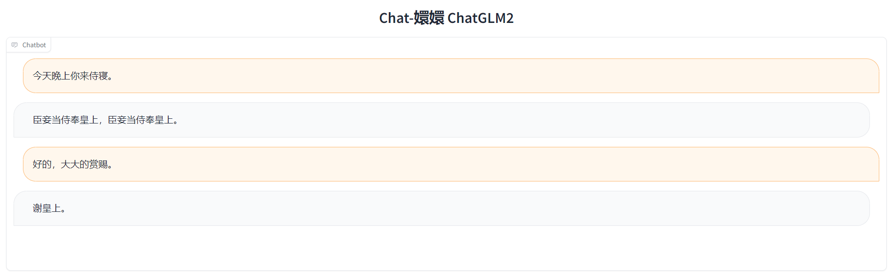

# Chat-嬛嬛 2.0

**Chat-甄嬛**是利用《甄嬛传》剧本中所有关于甄嬛的台词和语句，基于**ChatGLM2**进行**LoRA微调**得到的模仿甄嬛语气的聊天语言模型。

> 甄嬛，小说《后宫·甄嬛传》和电视剧《甄嬛传》中的女一号，核心女主角。原名甄玉嬛，嫌玉字俗气而改名甄嬛，为汉人甄远道之女，后被雍正赐姓钮祜禄氏，抬旗为满洲上三旗，获名“钮祜禄·甄嬛”。同沈眉庄、安陵容参加选秀，因容貌酷似纯元皇后而被选中。入宫后面对华妃的步步紧逼，沈眉庄被冤、安陵容变心，从偏安一隅的青涩少女变成了能引起血雨腥风的宫斗老手。雍正发现年氏一族的野心后令其父甄远道剪除，甄嬛也于后宫中用她的连环巧计帮皇帝解决政敌，故而深得雍正爱待。几经周折，终于斗垮了嚣张跋扈的华妃。甄嬛封妃时遭皇后宜修暗算，被皇上嫌弃，生下女儿胧月后心灰意冷，自请出宫为尼。然得果郡王爱慕，二人相爱，得知果郡王死讯后立刻设计与雍正再遇，风光回宫。此后甄父冤案平反、甄氏复起，她也生下双生子，在滴血验亲等各种阴谋中躲过宜修的暗害，最后以牺牲自己亲生胎儿的方式扳倒了幕后黑手的皇后。但雍正又逼甄嬛毒杀允礼，以测试甄嬛真心，并让已经生产过孩子的甄嬛去准格尔和亲。甄嬛遂视皇帝为最该毁灭的对象，大结局道尽“人类的一切争斗，皆因统治者的不公不义而起”，并毒杀雍正。四阿哥弘历登基为乾隆，甄嬛被尊为圣母皇太后，权倾朝野，在如懿传中安度晚年。

Chat-甄嬛 2.0，实现了以《甄嬛传》为切入点，打造一套基于小说、剧本的**个性化 AI** 微调大模型完整流程，通过提供任一小说、剧本，指定人物角色，运行本项目完整流程，让每一位用户都基于心仪的小说、剧本打造一个属于自己的、契合角色人设、具备高度智能的个性化 AI。

目前，本项目已实现数据集自动构建、开源模型微调、多维度部署等核心功能模块，支持用户自定义输入语料、指定角色风格，同时基于 ChatGLM、ChatGLM2、BaiChuan 等多种开源大模型，测试效果良好，欢迎大家体验交流~

目前LoRA微调技术参考[ChatGLM-Efficient-Tuning](https://github.com/hiyouga/ChatGLM-Efficient-Tuning)项目和[LLaMA-Efficient-Tuning](https://github.com/hiyouga/LLaMA-Efficient-Tuning)项目，欢迎给原作者项目star，所使用的[ChatGLM2-6B](https://github.com/THUDM/ChatGLM2-6B)模型、[BaiChuan](https://github.com/baichuan-inc/Baichuan-7B)模型也欢迎大家前去star。

bilibili介绍：[我也有自己的甄嬛啦！（chat嬛嬛项目）](https://www.bilibili.com/video/BV1dX4y1a73S/?spm_id_from=333.880.my_history.page.click&vd_source=1a432a45372ea0a0d1ec88a20d9cef2c)

## 使用方法

### 环境安装

首先下载本仓库，再用pip安装环境依赖：

```shell
git clone https://github.com/KMnO4-zx/huanhuan-chat.git
cd ./huanhuan-chat
pip install -r requirements.txt
```


## News

[2023.08.xx]：推出 Chat-甄嬛 v2.0 版本

[2023.08.xx]：完成 v2.0 数据集自动构建模块。

[2023.08.23]：完成 v2.0 GUI、API 部署功能模块。

[2023.08.13]：完成 v2.0 本地微调功能模块。

[2023.08.11]：完成 Chat-甄嬛 v2.0 架构设计。

[2023.08.06]：完成整体架构设计，参赛科大讯飞“星火杯”。

[2023.07.14]：完成 BaiChuan 模型训练及 web 调用，完成初步语音支持及数据集处理。

[2023.07.12]：完成RM、RLHF训练（存在问题），新的小伙伴加入项目。

[2023.07.11]：优化数据集，解决prompt句末必须携带标点符号的问题。

[2023.07.09]：完成初次LoRA训练。

## Edition

V2.0:

- [ ] 支持自定义语料库、角色风格，支持多种模型调用，支持多维度部署的 Chat-甄嬛 个性化 AI 系统。

V1.0：

- [x] 基于《甄嬛传》剧本、ChatGLM2、Lora 微调得到初代的chat-甄嬛聊天模型。


## To do

- [x] 实现V1.0Chat-甄嬛的训练及部署

- [ ] 数据集生成流程实现
    - [ ] 利用gpt从甄嬛传小说中提取特色对话集。
    - [ ] 优化甄嬛传剧本提取对话集。
    - [ ] 基于hugging face上日常对话数据集+GPT prompt+Langchain 生成个性化日常对话数据集
    - [ ] 探究生成多轮对话数据集

- [ ] 探索更多元的 Chat-甄嬛
    - [ ] 使用多种微调方法对ChatGLM2训练微调，找到最适合聊天机器人的微调方法。
    - [ ] 尝试多种开源大模型（Baichuan13B、ChatGLM等），找到效果最好的开源大模型
    - [ ] 寻找微调的最优参数

- [ ] 打造更智能的 Chat-甄嬛
    - [ ] 实现语音与甄嬛对话，生成数字人甄嬛
    - [ ] 实现支持并发、高可用性部署
    - [ ] 提升推理速度
    - [ ] 优化开发前后端
    - [ ] 使用Langchain与huanhuan-chat结合。

- [ ] 打造**个性化微调大模型通用流程**！ 

## 案例展示




## 人员贡献

[不要葱姜蒜](https://github.com/KMnO4-zx)：整理数据集，完成SFT训练。

[Logan Zou](https://github.com/nowadays0421)：完成 BaiChuan 训练及调用。

[coderdeepstudy](https://github.com/coderdeepstudy)：Window环境下的Lora微调，服务器支持。

[Bald0Wang](https://github.com/Bald0Wang)：完成甄嬛语音支持。
## 赞助

如果您愿意请我们喝一杯咖啡，帮助我们打造更美丽的甄嬛，那就再好不过了~


另外，如果您有意向，我们也接受私人定制，欢迎联系本项目负责人[不要葱姜蒜](https://github.com/KMnO4-zx)

