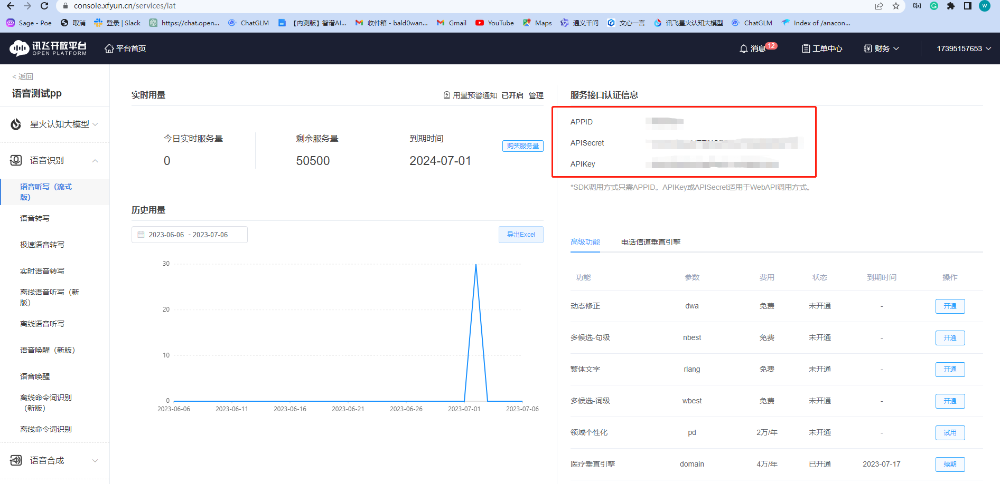

# 语音转文字与文字转语音实现GPT对话机器人(基于科大讯飞平台)

## 1.安装

确保你所处的操作系统已安装ffmpeg、python版本大于或等于3.8

[ffmpeg安装教程](https://zhuanlan.zhihu.com/p/623994780)

然后cd到工程目录下

安装所需依赖：

```bash
pip install -r requirements.txt --ignore-installed
```

安装一下langchain、openai对应的Python库

langchain>= 0.0.188

openai>=0.27.8

## 2.配置科大讯飞API

去[科大讯飞开放平台官网](https://console.xfyun.cn/services/iat)主策并申请语音识别的API并免费领取在线文字转语音和语音转文字次数后,获取到**APPID、APIKEY**与**APISecret**（注意一下  这个命名不一样）并将其填写到**ifly_api.txt**

可以先去白嫖https://www.xfyun.cn/free（个人五万条文字转语音语音转文字）



例如：

```bash
APP_ID:123456789
API_KEY:xxxxxxxxxxxxxxxxxxx
SECRET_KEY:xxxxxxxxxxxxxxx
```

##  3.配置openai key

.env文件写入你的key

开一下全局代理

## 4.开始使用

打开终端输入如下指令即可开始使用

```
python chatv2v.py
```

根据提示可以录入声音并转化为文字，而后gpt将文字转化为合成语音的多轮对话。

[视频链接](https://www.bilibili.com/video/BV18P411e7NJ/?spm_id_from=333.999.0.0&vd_source=1a432a45372ea0a0d1ec88a20d9cef2c)